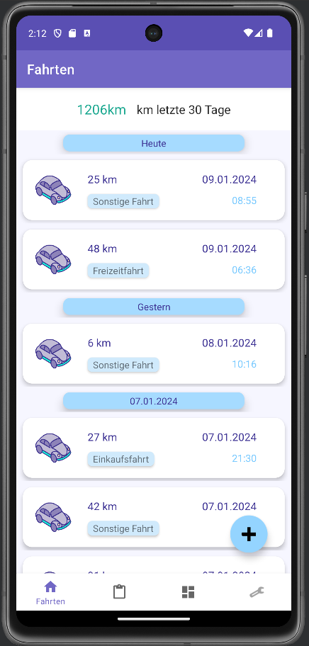
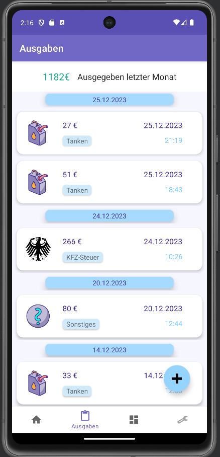
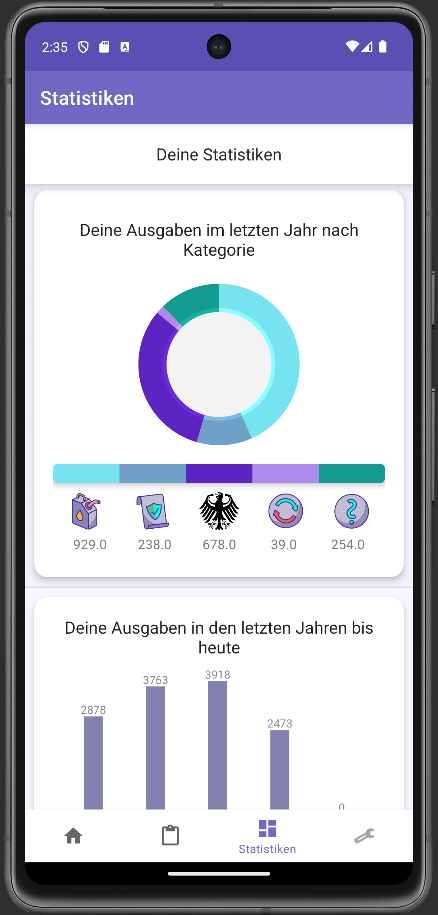

# Fahrtenbuch

**Fahrtenbuch** ist eine Android App zur Datenerfassung von Autos.

## Hauptmerkmal

- Automatische Fahrtenerkennung: Die App erkennt automatisch, wenn sich das Handy via Bluetooth mit dem Auto verbindet und beginnt die Fahrt über GPS zu tracken. Fahrten können aber auch manuell eingetragen werden

- Geofencing-Technologie: Durch Geofencing erkennt die App unterschiedliche Fahrttypen und passt das Tracking entsprechend an. Geofencing Standorte wie der Arbeitsplatz können in den Einstellungen definiert werden.

- Ausgabenverwaltung: Der Benutzer kann alle Ausgaben, die das Auto betreffen, in die App eintragen, um einen umfassenden Übeblick die Fahrzeugkosten zu erhalten.

- Statistikseite: Auf der Statistikseite werden aus den Daten verschiedene nützliche Statistiken erstellt, die dem Benutzer einen tieferen Einblick in seine Fahrgewohnheiten gibt.

## Installation

### Repository klonen: 
```bash
git clone https://https://github.com/FerreiraNuno/Fahrtenbuch-Android.git
```
### Projekt öffnen: 
1. In Android Studio ``Open an existing Android Studio project`` wählen und zum geklonten Repository navigieren.
2. Warten, bis Android Studio die Gradle-Synchronisation und Abhängigkeitsinstallation automatisch abschließt.


### Emulator/Gerät einrichten: 
Entweder einen Android-Emulator konfigurieren oder ein Android-Gerät mit aktivierten Entwickleroptionen über USB verbinden.

### App ausführen: 
Mit dem ``Run``-Button in Android Studio die App auf dem gewählten Gerät oder Emulator starten.


## Screenshots

### Fahrten Seite:


### Ausgaben Seite:


### Statistik Seite:

